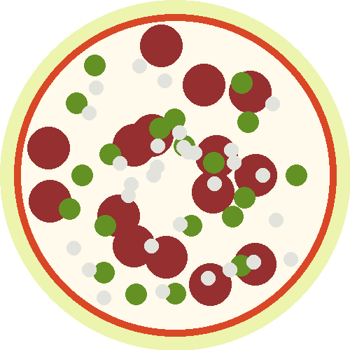

# Pizza Lab

In this lab you will let the user order pizza from the command line
with the toppings of their choice. The result will be an image
of a pizza, like this:



## Take the pizza order

Your program should accept ``y`` or ``n`` for input to all questions, and does not need to handle
invalid inputs.

First, your program should ask the user if they want pizza. If not, your program should exit without
creating and saving any image.

However, if the user does want pizza, your program should ask about toppings, first tomato
sauce, then cheese, then pepperoni, then jalapeno, then onion. (Make sure you spell the toppings
correctly, because the unit tests are are checking for exact matches!) For each topping, the user
can respond ``y`` or ``n``.

Finally, your program should save the pizza image to pizza.bmp, and tell the user the filename
so they can find it.

Here is an example where the user wants a pizza with all the toppings:

```
Welcome to PizzaMaker 2.0!
Would you like a pizza?
(y/n): y
Would you like tomato sauce?
(y/n): y
Would you like cheese with that?
(y/n): y
Would you like pepperoni?
(y/n): y
Would you like jalapeno with that?
(y/n): y
Would you like onion?
(y/n): y
Great! Your pizza is at pizza.bmp. Enjoy!
```

*Note: You must add toppings in the specified order here. This is called a "spec" (for specification), and it's
important to implement exactly to the "spec" so that the customer knows what they are getting.*

## Create the pizza image

Edit ``main.cc`` to create the pizza image.

The image should be 500x500 pixels, and it must be saved to ``pizza.bmp``.

You will be using the ``Image`` class to create your pizza.

You can create a new Image as follows:

```
Image my_image(width, height);
```

You can save the image as a bitmap (an uncompressed image format)
using the ``SaveImageBmp`` function:

```
my_image.SaveImageBmp("filename.bmp");
```

## Pizza functions

We've included ``pizza.h`` for you to use to draw your pizza. ``pizza.h`` is a header file, which
means that it can introduce functions while their implementation is in ``pizza.cc``. When using
other people's libraries you don't always have to understand how they are implemented,
but you do need to know the function signatures so that you can call their functions. The
signatures are defined in ``pizza.h``, and the implementation in ``pizza.cc``:Take
a look in ``pizza.h`` to see what's available, and if you like, peek into ``pizza.cc`` to see how
it actually works.

Here's the function signatures of the ``pizza.h`` functions you can use:

```
void AddCrust(Image& pizza);

void AddSauce(Image& pizza);

void AddCheese(Image& pizza);

void AddPepperoni(Image& pizza);

void AddOnion(Image& pizza);

void AddJalapeno(Image& pizza);
```

For example:

```
AddCrust(my_image);
```

## Building your lab
To compile your code, you will need to include a reference to the ``Image``
library implementation, the ``pizza`` functions, and add a few extra arguments to ensure
your machine can create the graphics (``-lm -lX11 -lpthread``).

```
clang++ -std=c++17 main.cc pizza.cc cpputils/graphics/image.cc -o main -lm -lX11 -lpthread
```

You can use this command directly, or type ``make build``, a shortcut we've included for you
in your Makefile.

*Note: On a Mac you will need a few additional flags. Use ``make build``, it's easier!*

# Submission checklist
1. Compiled and ran the driver (`main`).
1. Manually checked for compilation and logical errors.
1. Ensured no errors on the unit test (`make test`).
1. Followed advice from the stylechecker (`make stylecheck`).
1. Followed advice from the formatchecker to improve code readability (`make formatcheck`).

# Code evaluation
Open the terminal and navigate to the folder that contains this exercise. Assuming you have pulled the code inside of `/home/student/labex02-tuffy` and you are currently in `/home/student` you can issue the following commands

```
cd labex02-tuffy
```

You also need to navigate into the problem you want to answer. To access the files needed to answer problem 1, for example, you need to issue the following command.

```
cd prob01
```

When you want to answer another problem, you need to go back up to the parent folder and navigate into the next problem. Assuming you are currently in `prob01`, you can issue the following commands to go to the parent folder then go into another problem you want to answer; `prob02` for example.

```
cd ..
cd prob02
```

Use the `clang++` command to compile your code and the `./` command to run it. The sample code below shows how you would compile code save in `main.cc` and into the executable file `main`. Make sure you use the correct filenames required in this problem.  Take note that if you make any changes to your code, you will need to compile it first before you see changes when running it.

```
clang++ -std=c++17 main.cc -o main
./main
```

You can run one, two, or all the commands below to `test` your code, `stylecheck` your code's design, or `formatcheck` your work. Kindly make sure that you have compiled and executed your code before issuing any of the commands below to avoid errors.

```
make test
make stylecheck
make formatcheck
```

A faster way of running all these tests uses the `all` parameter.

```
make all
```

# Submission
1. When everything runs correctly,  let's copy your code into the Github repository. The first step is to add your code to what is called the staging area using git's `add` command. The parameter after `add` is the name of the file you want to add. There are cases when you have multiple changed files, so you can just type . (period) to add all modified files.

    ```
    git add main.cc
    ```
1. Once everything is in the staging area, we use the `commit` command to tell git that we have added everything we need into the staging area.

    ```
    git commit
    ```
    Alternatively, you could add a comment to the `commit` command in order to skip the *nano* editor step described below.

    ```
    git commit -m "Finished prob01"
    ```
1. In case it asks you  to configure global variables for an email and name, just copy the commands it provides then replace the dummy text with your email and Github username.

    ```
    git config --global user.email "tuffy@csu.fullerton.edu"
    git config --global user.name "Tuffy Titan"
    ```
    When you're done, make sure you type `git commit` again.    
1. Git will ask you to describe what you have added to the staging area. By default, you will use a command-line based editor called *nano*. Go ahead and provide a description then press <kbd>Ctrl</kbd> + <kbd>x</kbd> to exit. Press <kbd>Y</kbd> to confirm that you want to make changes and then press <kbd>Enter</kbd>.
1. Lets push all changes to the Github repository using git's `push` command. Provide your Github username and password when you are asked.

    ```
    git push
    ```
