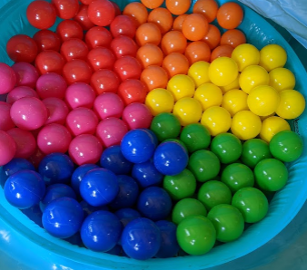

# Desaturate an Image

In this lab you will desaturate an image. That is, you will change it from colorful to black and white.

## What makes a digital image greyscale?

We see white on a digital display when Red, Green and Blue components of a pixel are all on as bright as possible: all set to 255.

We see black when Red, Green and Blue are all off: all set to 0.

In between white and black is grey. For any lightness of grey, the Red, Green and Blue channels are equal to each other, and can be anywhere in the range from 1 (very, very dark grey) to 254 (almost white).

You can desaturate a colored image by averaging the Red, Green and Blue pixel values at each pixel location in the image.

## Implement the ``Desaturate`` function

We've provided code to get an image file from the user over the command line, load it, display it, and save it as ``output.bmp``. All you need to do is fill in the body of the function ``Desaturate`` in ``desaturate.cc``.

You will need to loop (hint: use ``for`` loops) over every pixel in the image and desaturate them one by one. Some helpful functions you can call on a ``graphics::Image`` are:

```cpp
// Returns the width and height of the image.
int GetWidth();
int GetHeight();

// Gets the red, green or blue pixel value at an (x, y) pixel location.
int GetRed(int x, int y);
int GetGreen(int x, int y);
int GetBlue(int x, int y);

// Sets the red, green or blue pixel value at an (x, y) pixel location.
bool SetRed(int x, int y, int red);
bool SetGreen(int x, int y, int green);
bool SetBlue(int x, int y, int blue);
```

Here's how these can be used:

```cpp
// Gets the width of the image.
int width = image.GetWidth();
// Gets the height of the image.
int height = image.GetHeight();
// Gets the red channel of the center pixel.
int red = image.GetRed(width / 2, width / 2);
// Sets the blue channel of the center pixel to be equal to the red one.
image.SetBlue(width / 2, width / 2, red);
```

You can learn more about using ``graphics::Image`` in the [Intro to Images](https://lab.cs50.io/ILXL-guides/intro-to-graphics) walk-through.

## Run the program to desaturate images

To manually test ``Desaturate`` you can compile and run this program with:

```
clang++ -std=c++17 main.cc desaturate.cc cpputils/graphics/image.cc -o main -lm -lX11 -lpthread
./main
```

*Note: you need a few additional flags on Mac*

However, that's a lot to type, so we've included a shortcut to compile and create ``main``:

```
make build
./main
```

We've provided a .bmp format image for you at ``input.bmp``, but you are welcome to try this on your own images!



*Note: some platforms have difficulty loading images which are not .bmp format, but you can find image bmp converters online.*

## Run the unit tests

We've provided unit tests, which you can try with ``make test``. Use the output to help you debug any issues in your program.

# Submission checklist
1. Compiled and ran the driver (`main`).
1. Manually checked for compilation and logical errors.
1. Ensured no errors on the unit test (`make test`).
1. Followed advice from the stylechecker (`make stylecheck`).
1. Followed advice from the formatchecker to improve code readability (`make formatcheck`).

# Code evaluation
Open the terminal and navigate to the folder that contains this exercise. Assuming you have pulled the code inside of `/home/student/labex02-tuffy` and you are currently in `/home/student` you can issue the following commands

```
cd labex02-tuffy
```

You also need to navigate into the problem you want to answer. To access the files needed to answer problem 1, for example, you need to issue the following command.

```
cd prob01
```

When you want to answer another problem, you need to go back up to the parent folder and navigate into the next problem. Assuming you are currently in `prob01`, you can issue the following commands to go to the parent folder then go into another problem you want to answer; `prob02` for example.

```
cd ..
cd prob02
```

Use the `clang++` command to compile your code and the `./` command to run it. The sample code below shows how you would compile code save in `main.cc` and into the executable file `main`. Make sure you use the correct filenames required in this problem.  Take note that if you make any changes to your code, you will need to compile it first before you see changes when running it.

```
clang++ -std=c++17 main.cc -o main
./main
```

You can run one, two, or all the commands below to `test` your code, `stylecheck` your code's design, or `formatcheck` your work. Kindly make sure that you have compiled and executed your code before issuing any of the commands below to avoid errors.

```
make test
make stylecheck
make formatcheck
```

A faster way of running all these tests uses the `all` parameter.

```
make all
```

# Submission

We recommend pushing to Github frequently to back up your work.
