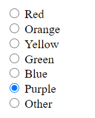

# Radio button

Radio buttons are a common input type that presents buttons in groups. At most one radio button in a group can be selected at a time.



In this lab you will create a ``RadioButton`` class and then create methods to interact with vectors of ``RadioButton``. Then you will complete ``main.cc`` to create a program which allows the user to create and select radio buttons. Here is an example of the final input/output expected from ``main``:

```
How many radio buttons? 3
Text for button at index 0? Cats rule
Text for button at index 1? Dogs drool
Text for button at index 2? Other
( ) Cats rule
( ) Dogs drool
( ) Other
No button selected yet.

What button index would you like to select? 0
(*) Cats rule
( ) Dogs drool
( ) Other
Button at index 0 is selected.
Select again? ("quit" to exit) yes

What button index would you like to select? 2
( ) Cats rule
( ) Dogs drool
(*) Other
Button at index 2 is selected.
Select again? ("quit" to exit) quit
```

## Write the ``RadioButton`` class

The ``RadioButton`` class will need member variables to track the currently selected state and its text.

``RadioButton`` must have public getters and setters for the text:
1. a method ``SetText`` that takes a ``std::string`` parameter and,
2. a method ``GetText`` that returns that ``std::string``.

``RadioButton`` must also have public getters and setters for the selected state:
3. a setter ``SetSelected`` which takes a ``bool`` parameter (``true`` to set the button selected, ``false`` to unselect), and,
4. a getter ``IsSelected`` which returns a ``bool`` (``true`` if the ``RadioButton`` is selected and ``false`` otherwise).

You can define the class and method prototypes in ``radio_button.h``, and implement them in ``radio_button.cc``.

Please ensure your two getters are ``const`` as they should not change any member variables.

## Helper method ``SelectRadioButton``

In ``radio_button.h`` define the prototype for the method ``SelectRadioButton`` which should take two parameters, a ``std::vector<RadioButton>`` of all the buttons and an integer which represents the index into that vector which should be set to selected. (You should decide whether or not to use a reference parameter for the vector.) Implement ``SelectRadioButton`` in ``radio_button.cc``. ``SelectRadioButton`` is *not* a member function of the ``RadioButton`` class.

 Using the ``SetSelected`` function, ``SelectRadioButton`` should select the button at the given index and make sure all other ``RadioButton``s in the vector are unselected.

 *Note: you may need to operate on the items directly in the vector, using notation like ``buttons[3].SetSelected(true)``.*

 *Alternatively, if you want to make a temporary ``RadioButton`` variable from the vector you will need to assign it into a reference type variable, like ``RadioButton& button_ref = buttons[1];``. Simply doing ``RadioButton button_copy = buttons[1]`` (without ``&``) makes the variable ``button`` into a copy of the element at index 1 in the vector. ``button_ref`` refers to the original object in the vector, while ``button_copy`` is a separate copy of the object. Changes made to ``button_copy`` do not impact the ``RadioButton`` it was copied from.*

## Helper method ``PrintRadioButtons``

Like ``SelectRadioButton``, ``PrintRadioButtons`` should have its prototype defined in ``radio_button.h`` and implementation in ``radio_button.cc``, although it is *not* a member function of the ``RadioButton`` class.

``PrintRadioButtons`` should take one parameter, a ``const std::vector<RadioButton>``, and use ``std::cout`` to display the radio buttons in the vector to the terminal. (You should decide whether or not to use a reference parameter here.) Implement ``PrintRadioButtons`` in ``radio_button.cc``.

The print formatting should be as follows:

* For an unselected button, the line should begin with a open parenthesis, a space, and then a close parenthesis, ``( )``.

* For a selected button, the same thing except the space is replaced by an asterisk, ``(*)``.

* Use the ``GetText`` method of each button to print the button text.

For example, a selected button with text "Pikachu I choose you" would look like:
```
(*) Pikachu I choose you
```

After printing a line like this for all the radio buttons in the vector the ``PrintRadioButtons`` should say which button is selected, for example,
```
The button at index 0 is selected
```
Or, if no button is selected, it would print,
```
No button selected yet
```

## Complete ``main``

We've provided most of ``main.cc`` for you. You just need to complete four parts, which are numbered in ``main.cc``:

1. Create a ``RadioButton`` and set the text to ``text``, and ensure that it is not selected in the ``for`` loop. Add it to the existing ``buttons`` vector using the vector method ``push_back``.

2. Use the ``PrintRadioButtons`` function to display the ``buttons`` vector after all the buttons have been created.

3. Use your ``SelectRadioButton`` function to select the index at ``index`` in the ``buttons`` vector in the ``do/while`` loop.

4. Use the ``PrintRadioButtons`` function to display the ``buttons`` vector in the ``do/while`` loop.

## Hints

* Don't forget to include ``<vector>``, ``<string>`` and ``<iostream>`` where needed, as well as ``"radio_button.h"``.

* Consider whether you should pass the vector by reference or by value in ``PrintRadioButtons`` and ``SelectRadioButton``.

## Run the program

To manually test your code you can compile and run with:

```
clang++ -std=c++17 main.cc radio_button.cc -o main
./main
```

## Run the unit tests

We've provided unit tests, which you can try with ``make test``. Use the output to help you debug any issues in your program.

# Submission checklist
1. Completed radio button definition and implementation (`radio_button.h` and `radio_button.cc`).
1. Compiled and ran the driver (`main`).
1. Manually checked for compilation and logical errors.
1. Ensured no errors on the unit test (`make test`).
1. Followed advice from the stylechecker (`make stylecheck`).
1. Followed advice from the formatchecker to improve code readability (`make formatcheck`).

# Code evaluation
Open the terminal and navigate to the folder that contains this exercise. Assuming you have pulled the code inside of `/home/student/labex02-tuffy` and you are currently in `/home/student` you can issue the following commands

```
cd labex02-tuffy
```

You also need to navigate into the problem you want to answer. To access the files needed to answer problem 1, for example, you need to issue the following command.

```
cd prob01
```

When you want to answer another problem, you need to go back up to the parent folder and navigate into the next problem. Assuming you are currently in `prob01`, you can issue the following commands to go to the parent folder then go into another problem you want to answer; `prob02` for example.

```
cd ..
cd prob02
```

Use the `clang++` command (or ``make build``) to compile your code and the `./` command to run it. The sample code below shows how you would compile code saved in `main.cc` and `radio_buutton.cc` and into the executable file `main`. Make sure you use the correct filenames required in this problem.  Take note that if you make any changes to your code, you will need to compile it first before you see changes when running it.

```
clang++ -std=c++17 main.cc radio_button.cc -o main
./main
```

You can run one, two, or all the commands below to `test` your code, `stylecheck` your code's design, or `formatcheck` your work. Kindly make sure that you have compiled and executed your code before issuing any of the commands below to avoid errors.

```
make test
make stylecheck
make formatcheck
```

A faster way of running all these tests uses the `all` parameter.

```
make all
```

# Submission

We recommend pushing to Github frequently to back up your work.
