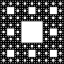

# Sierpiński's Carpet

The Sierpiński carpet is a plane fractal first described by Wacław Sierpiński in 1916 ([Wikipedia](https://en.wikipedia.org/wiki/Sierpi%C5%84ski_carpet)).

The construction of a Sierpiński carpet is recursive. We can describe it based on the depth we want the recursion to go.

If the recursive depth is zero, the carpet is simply a square.

If the recursive depth is one, the carpet is divided into a three-by-three grid and the outer eight squares are filled in recursively (i.e. a square is drawn at depth 0) while the central square is left blank.

If the recursive depth is two, the carpet is divided into a three-by-three grid and the outer eight squares are filled in with depth one (that means, that each of the outer squares will be subdivided into mini 3x3 grids at depth 1, and the outer 8 cells of each mini grid will be filled in as a solid square at depth 0).

*Below are examples of the carpet for recursive depth 0, 1, 2, 3 and 4.*




## Implement ``DrawCarpet``

We've provided ``main.cc`` and a ``DrawCarpet`` prototype. You only need to implement ``DrawCarpet`` in ``carpet.cc``.

```cpp
void DrawCarpet(int x, int y, int size, int order, graphics::Image& image);
```

This function takes parameters:
* `x` and `y`, which represent the top left corner of your carpet in the image.
* `size`, the width and height of your carpet (it's a square). You can assume size is evenly divisible by 3.
* `order`, the recursive depth to which you should draw the carpet, and
* a `graphics::Image` onto which to draw the carpet.

The carpet should be colored black, i.e. a ``graphics::Color`` of (0, 0, 0).

You may want to make use of the ``DrawRectangle`` function from ``graphics::Image``:

```cpp
/**
 * Draws a rectangle with upper left corner at (x, y) and size
 * |width| by |height|, colored by |color|.
 * Returns false if params are out of bounds.
 */
bool DrawRectangle(int x, int y, int width, int height, graphics::Color color);
```

```cpp
graphics::Image image(200, 200);
image.DrawRectangle(99, 0, 199, size, graphics::Color(255, 0, 0));
```

Use the ``main`` program to test your work by passing in various parameters as the "order", i.e. the recursive depth.

```
make build
./main
```

The main function will draw ``carpet.bmp`` which you can use to inspect your work.

## Hints

Recursion can be tricky. Try to give it a shot yourself, but here are some hints if you get stuck!

### Base case

In the base case the order of the fractal is zero, so you simply need to draw a square at the appropriate position and size in the image.

### Recursive case

Subdivide the image into 9 parts (a three-by-three grid) and recursively call ``DrawCarpet`` on each of those parts as needed. Note that you need to make a change to the parameters you pass to ensure you eventually reach your base case.

## Run the unit tests

We've provided unit tests, which you can try with ``make test``. Use the output to help you debug any issues in your program.

## Other cool stuff

The  is an example of a [substitution system](https://www.wolframscience.com/nks/p187--substitution-systems-and-fractals/). Other [examples](https://www.wolframscience.com/nks/p188--substitution-systems-and-fractals/) abound. If you are enjoying this, try implementing some more fractals from substitution systems just for fun!

# Submission checklist
1. Compiled and ran the driver (`main`).
1. Manually checked for compilation and logical errors.
1. Ensured no errors on the unit test (`make test`).
1. Followed advice from the stylechecker (`make stylecheck`).
1. Followed advice from the formatchecker to improve code readability (`make formatcheck`).

# Code evaluation
Open the terminal and navigate to the folder that contains this exercise. Assuming you have pulled the code inside of `/home/student/labex02-tuffy` and you are currently in `/home/student` you can issue the following commands

```
cd labex02-tuffy
```

You also need to navigate into the problem you want to answer. To access the files needed to answer problem 1, for example, you need to issue the following command.

```
cd prob01
```

When you want to answer another problem, you need to go back up to the parent folder and navigate into the next problem. Assuming you are currently in `prob01`, you can issue the following commands to go to the parent folder then go into another problem you want to answer; `prob02` for example.

```
cd ..
cd prob02
```

Use the `clang++` command (or ``make build``) to compile your code and the `./` command to run it. The sample code below shows how you would compile code save in `main.cc` and `carpet.cc` and into the executable file `main`. Make sure you use the correct filenames required in this problem.  Take note that if you make any changes to your code, you will need to compile it first before you see changes when running it.

```
clang++ -std=c++17 main.cc carpet.cc cpputils/graphics/image.cc -o main -lm -lX11 -lpthread
./main
```

You can run one, two, or all the commands below to `test` your code, `stylecheck` your code's design, or `formatcheck` your work. Kindly make sure that you have compiled and executed your code before issuing any of the commands below to avoid errors.

```
make test
make stylecheck
make formatcheck
```

A faster way of running all these tests uses the `all` parameter.

```
make all
```

# Submission

We recommend pushing to Github frequently to back up your work.
