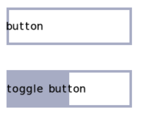

# User Interface Component: Buttons

This lab practices with inheritance and composition by having you create two types of user interface buttons.

A button is a piece of user interface that allows a user to create an action by clicking. In this lab, a button can have two states: a normal state and an active state. Buttons become active when the user presses down the mouse button while over them, and inactive when the button is released.


([source](https://xd.adobe.com/ideas/process/ui-design/designing-interactive-buttons-states/))

A toggle button is a special type of button that can be enabled or disabled like a switch. It also has an inactive state by default and an active state when the user presses on it.


([source](https://xd.adobe.com/ideas/process/ui-design/designing-interactive-buttons-states/))

We provide very basic interaction and drawing in ``main.cc``, and you do not need to edit this file (although you can edit it if you want to do more! For example, add new colors or change the drawing to make it look better!) ``main.cc``'s output isn't tested, but we do need your program to compile -- so make sure it compiles when you submit. Here's how it looks when you run the program. You can use this to debug and try out your buttons.



## Create ``Rect`` class

Each button takes up a rectangle on the screen which can be specified with an (x, y) position of the top left corner and a width and a height. This will be stored in a ``Rect`` object.

Create a ``Rect`` class in ``rect.h`` and implement the methods in ``rect.cc``. ``Rect`` should have a constructor which takes integer x, y, width and height, and getters for each of these (``GetX()``, ``GetY()``, ``GetWidth()`` and ``GetHeight()``).

``Rect`` needs one member function, ``Contains``, which takes a x and y coordinate and returns a boolean, ``true`` if that coordinate is within the rectangle and ``false`` if it is not. If the coordinate is on the edge, it counts as in the rectangle (i.e. a rectangle at (10, 10) with width 5 and height 5 would contain the point (10, 15) as well as (12, 12)).

## Create ``Button`` class

### Constructors

``Button`` must have a non-default constructor that takes a ``std::string`` the button name, and a ``Rect`` of where the button belongs on the page.

``Button`` must have a default constructor which you can initialize however you see fit.

### Getters and setters

Implement a ``SetActive`` function that takes a ``bool``, and a ``GetActive`` function that returns a ``bool``. ``Button`` should not be active by default (at construction). You will need to create a member variable to track active state.

Implement a ``GetRect`` function that returns the ``Rect`` which was passed into the constructor.

Implement a ``GetName`` function that returns the ``std::string`` name which was passed into the constructor.

### Member functions

Implement a ``Click`` function that does a ``std::cout`` which prints ``Clicked `` plus the button name, i.e. for a ``Button`` named "button", ``Clicked button``.

## Create ``ToggleButton`` class which inherits from ``Button``

### Constructors

``ToggleButton`` must have a non-default constructor that takes a ``std::string`` the toggle button name, and a ``Rect`` of where the button belongs on the page. This should call the parent class constructor.

``ToggleButton`` must have a default constructor which you can initialize however you see fit.

### Getters and setters

Implement a ``GetEnabled`` function that returns ``true`` if the ``ToggleButton`` is enabled and ``false`` otherwise. ``ToggleButton`` should not be enabled by default.

You will need to create a member variable to track enabled state.

### Member functions

``ToggleButton`` should implement the ``Click`` function, overriding the ``Button::Click`` from the parent class. It should do a ``std::cout`` which prints ``Clicked `` plus the button name plus the button state, "(enabled)" or "(disabled)" i.e. for a ``ToggleButton`` named "toggle", ``Clicked toggle (enabled)`` or ``Clicked toggle (disabled)``.

Each time you ``Click`` the ``ToggleButton`` its enabled state should change, so you could see:

```
Clicked toggle (enabled)
Clicked toggle (disabled)
Clicked toggle (enabled)
Clicked toggle (disabled)
```

## Run the program

To manually test your code you can compile and run with a shortcut to create ``main``:

```
make build
./main
```

When you click the buttons in the window you should see interactions if you've implemented the ``GetActive``, ``SetActive``, ``GetEnabled``, and ``Click`` functions properly.

## Run the unit tests

We've provided unit tests, which you can try with ``make test``. Use the output to help you debug any issues in your program.

# Submission checklist
1. Created ``Rect``, ``Button`` and ``ToggleButton`` classes.
1. Compiled and ran the driver (`main`).
1. Manually checked for compilation and logical errors.
1. Ensured no errors on the unit test (`make test`).
1. Followed advice from the stylechecker (`make stylecheck`).
1. Followed advice from the formatchecker to improve code readability (`make formatcheck`).

# Code evaluation
Open the terminal and navigate to the folder that contains this exercise. Assuming you have pulled the code inside of `/home/student/labex02-tuffy` and you are currently in `/home/student` you can issue the following commands

```
cd labex02-tuffy
```

You also need to navigate into the problem you want to answer. To access the files needed to answer problem 1, for example, you need to issue the following command.

```
cd prob01
```

When you want to answer another problem, you need to go back up to the parent folder and navigate into the next problem. Assuming you are currently in `prob01`, you can issue the following commands to go to the parent folder then go into another problem you want to answer; `prob02` for example.

```
cd ..
cd prob02
```

Use the `clang++` command (or ``make build``) to compile your code and the `./` command to run it. The sample code below shows how you would compile code saved in `main.cc` `button.cc` `rect.cc` and `toggle_button.cc` and into the executable file `main`. Make sure you use the correct filenames required in this problem.  Take note that if you make any changes to your code, you will need to compile it first before you see changes when running it.

```
clang++ -std=c++17 main.cc button.cc rect.cc toggle_button.cc -o main
./main
```

You can run one, two, or all the commands below to `test` your code, `stylecheck` your code's design, or `formatcheck` your work. Kindly make sure that you have compiled and executed your code before issuing any of the commands below to avoid errors.

```
make test
make stylecheck
make formatcheck
```

A faster way of running all these tests uses the `all` parameter.

```
make all
```

# Submission

We recommend pushing to Github frequently to back up your work.
