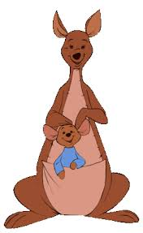

# Kangaroo class inheritance

In this lab you will create a ``Kangaroo`` class, and two subclasses of ``Kangaroo``, a ``Doe`` and a ``Joey``. Does are female kangaroos, and Joeys are babies. Joeys live within their mothers pouch until they are ready to be on their own. You will represent these relationships in these C++ classes.



## ``Kangaroo`` class

``Kangaroo`` objects must track their name and bounce count.

Create a constructor which takes a ``std::string`` the name of the Kangaroo, and a default constructor that sets the name as you see fit.

Create public getters and setters for the ``std::string`` name, ``GetName`` and ``SetName``.

Create a public getter for the bounce count which returns an integer, called ``GetBounceCount``.

Create a ``protected`` setter for the bounce count.

Finally, create a public member function ``Bounce`` which takes no arguments. ``Bounce`` should increment the bounce count and also print the name of the kangaroo plus "goes boing", i.e. for a ``Kangaroo`` with name ``Kanga``, ``Bounce`` would print ``Kanga goes boing``.

## ``Joey`` class

``Joey`` should inherit from ``Kangaroo``. Create constructor which takes a ``std::string`` the name of the Joey, and a default constructor that sets the name as you see fit.

## ``Doe`` class

A ``Doe`` has a member variable which is of type ``Joey``, representing the baby kangaroo in her pouch.

``Doe`` should inherit from ``Kangaroo``. Create constructor which takes a ``std::string`` the name of the Doe, a ``std::string`` the name of the Joey, and a default constructor that sets the names as you see fit.

``Doe`` needs a ``GetJoey`` function that returns a reference to the ``Joey`` member variable.

Override ``Kangaroo::Bounce`` to print the same thing and increment the ``Doe``'s bounce count using the protected method on ``Kangaroo``. ``Doe::Bounce`` should also call ``Bounce`` on the member ``Joey``.

## ``main.cc``

Implement a program in ``main.cc`` which asks the user for the name of a Doe and her Joey, creates a Doe with that name and that Joey's name.

Then have the Doe bounce and the Joey also bounce, and continue asking each to Bounce once until the user is done. This means the Joey will have two bounces counted for every one bounce counted by the Doe.

Specifically:

Use the ``Doe::GetJoey`` method to get a reference to the Joey. Within the loop, call ``Bounce`` on both the Joey reference and the Doe, and print out the total number of bounces for each using the format ""*name* has bounced *n* times", i.e. "Kanga has bounced 3 time". You can use the functions ``Kangaroo::GetName()`` and ``Kangaroo::GetBounceCount()`` on the Joey and Doe to construct these sentences.

Ask the user if they want to bounce again, and while they don't say "n", ``Bounce`` the Doe and the Joey, then print out the total number of bounces for each again. The code to run the loop is provided.

Here's how the terminal output should look when you run your program:

```
What is the doe's name? Kanga
What is the joey's name? Roo
Kanga goes boing
Roo goes boing
Roo goes boing
Kanga has bounced 1 times.
Roo has bounced 2 times.
Do you want to bounce again? "n" to exit y
Kanga goes boing
Roo goes boing
Roo goes boing
Kanga has bounced 2 times.
Roo has bounced 4 times.
Do you want to bounce again? "n" to exit n
```

## Run the program

To manually test your code you can compile and run with:

```
clang++ -std=c++17 main.cc doe.cc kangaroo.cc joey.cc -o main
./main
```

## Run the unit tests

We've provided unit tests, which you can try with ``make test``. Use the output to help you debug any issues in your program.

# Submission checklist
1. Compiled and ran the driver (`main`).
1. Manually checked for compilation and logical errors.
1. Ensured no errors on the unit test (`make test`).
1. Followed advice from the stylechecker (`make stylecheck`).
1. Followed advice from the formatchecker to improve code readability (`make formatcheck`).

# Code evaluation
Open the terminal and navigate to the folder that contains this exercise. Assuming you have pulled the code inside of `/home/student/labex02-tuffy` and you are currently in `/home/student` you can issue the following commands

```
cd labex02-tuffy
```

You also need to navigate into the problem you want to answer. To access the files needed to answer problem 1, for example, you need to issue the following command.

```
cd prob01
```

When you want to answer another problem, you need to go back up to the parent folder and navigate into the next problem. Assuming you are currently in `prob01`, you can issue the following commands to go to the parent folder then go into another problem you want to answer; `prob02` for example.

```
cd ..
cd prob02
```

Use the `clang++` command (or ``make build``) to compile your code and the `./` command to run it. The sample code below shows how you would compile code save in `main.cc` `kangaroo.cc` `joey.cc` and `doe.cc` and into the executable file `main`. Make sure you use the correct filenames required in this problem.  Take note that if you make any changes to your code, you will need to compile it first before you see changes when running it.

```
clang++ -std=c++17 main.cc kangaroo.cc joey.cc doe.cc -o main
./main
```

You can run one, two, or all the commands below to `test` your code, `stylecheck` your code's design, or `formatcheck` your work. Kindly make sure that you have compiled and executed your code before issuing any of the commands below to avoid errors.

```
make test
make stylecheck
make formatcheck
```

A faster way of running all these tests uses the `all` parameter.

```
make all
```

# Submission

We recommend pushing to Github frequently to back up your work.
