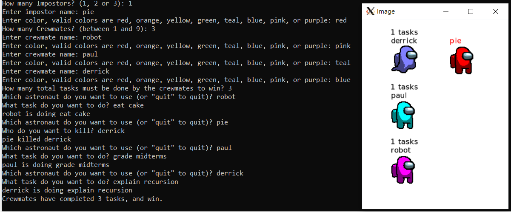

# Among Us: Character classes

This lab practices with inheritance and method overriding by having you create characters from the game "Among Us".

We provide a very basic gameplay in ``main.cc``, and you do not need to edit this file (although you can edit it if you want! for example, add new colors or change the drawing!) ``main.cc``'s output isn't tested, but we do need your program to compile -- so make sure it compiles when you submit. Here's how it looks when you run the program:



You will create a ``Astronaut`` class that stores a name and color. This will be inherited by a ``Crewmate`` subclass which has some crewmate-specific functionality to do tasks and get/set whether it is alive, and also a ``Impostor`` subclass which has functionality to kill a ``Crewmate``.

## Overview of game

Knowledge of the real game is not important for implementing these classes. Here's how our version works:

Impostors and Crewmates look alike but have different goals. Both have names and colors, but while Crewmates can do tasks, Impostors try to kill Crewmates. If the Impostors kill all the Crewmates they win, but if the Crewmates complete a total number of tasks first, the Crewmates win instead.

Note that crewmates can continue to do tasks after they are not alive.

## Create ``Astronaut`` class

Create an ``Astronaut`` class in ``astronaut.h`` and implement the methods in ``astronaut.cc``.

The ``Astronaut`` class should have a constructor that takes a ``std::string`` which is the astronaut's name, and a ``graphics::Color`` which is the astronaut's main color. Store these in member variables.

``Astronaut`` needs a const ``GetName`` function which returns its name, a ``std::string``.

The ``Astronaut`` class needs a const virtual getter for the ``graphics::Color`` called ``GetColor``.

Finally, the ``Astronaut`` class needs a const virtual method, ``GetIconFilename``, which returns a ``std::string`` filename of the icon to draw. ``Astronaut::GetIconFilename`` should return "astronaut.bmp".

## Create ``Crewmate`` class which inherits from ``Astronaut``

Create a ``Crewmate`` class in ``crewmate.h`` and implement its methods in ``crewmate.cc``. The ``Crewmate`` must inherit from ``Astronaut``. ``Crewmate`` has two private member variables, a boolean to track whether it is alive (default true), and a integer to track the task count (default 0). ``Crewmate`` must have a constructor which takes a ``std::string`` name and a ``graphics::Color`` and calls the superclass constructor. In addition it must also have a default constructor that takes no arguments.

``Crewmate`` should have a const getter, ``GetIsAlive``, and a setter called ``SetIsAlive``.

``Crewmate`` should have a const getter for the task count called ``GetTaskCount``. It should have a function called ``DoTask`` which takes a ``std::string`` parameter, the name of the task to do. When ``DoTask`` is called, ``Crewmate`` should increment its member variable for task count and also ``std::cout`` its name followed by " is doing " and then the task name, i.e. for a ``Crewmate`` named ``robot`` and a task called "gardening":

```
robot is doing gardening
```

``Crewmate`` also overrides two methods from ``Astronaut``, ``GetColor`` and ``GetIconFilename``. In ``crewmate.h`` you can define the function prototypes for these overridden functions, and place the implementations in ``crewmate.cc``.

For both of these functions, if the ``Crewmate`` is alive you can return the result from the superclass, i.e. ``Astronaut::GetColor()`` or ``Astronaut::GetIconFilename()`` respectively.

But if the ``Crewmate`` is dead, you will need to return a different result. For the filename, return "ghost.bmp" when the crewmate is dead. For the color, return the original color shifted 1/2 of the way to white. Here's how you can shift the color, assuming that you have a ``graphics::Color color`` which is the original color:

```cpp
graphics::Color shifted((color.Red() + 256) / 2,
                        (color.Green() + 256) / 2,
                        (color.Blue() + 256) / 2);
```

## Create ``Impostor`` class which inherits from ``Astronaut``

Create an ``Impostor`` class in ``impostor.h`` and implement its methods in ``impostor.cc``. The ``Impostor`` must inherit from ``Astronaut``. It must have a constructor which takes a ``std::string`` name and a ``graphics::Color`` and calls the superclass constructor. In addition it must also have a default constructor that takes no arguments. (For this you may pass any arguments you like to the non-default constructor.)

The ``Impostor`` class has one method, a ``Kill`` function which is const and  which takes a single parameter, a reference to a ``Crewmate``, i.e. a ``Crewmate&``. When the ``Kill`` function is called the ``Impostor`` class should print the impostor's name and who they killed, i.e. for an impostor named "pie" and a crewmate named "robot" it would ``std::cout``:

```
"pie killed robot"
```

### Ensure the ``Impostor`` changes ``Crewmate`` when ``Kill`` is called

``Impostor::Kill`` function should call ``Crewmate::SetIsAlive`` with ``false`` on the crewmate parameter.

## Run the program

To manually test your code you can compile and run with a shortcut to create ``main``:

```
make build
./main
```

## Run the unit tests

We've provided unit tests, which you can try with ``make test``. Use the output to help you debug any issues in your program.

# Submission checklist
1. Created ``Astronaut``, ``Impostor`` and ``Crewmate`` classes.
1. Compiled and ran the driver (`main`).
1. Manually checked for compilation and logical errors.
1. Ensured no errors on the unit test (`make test`).
1. Followed advice from the stylechecker (`make stylecheck`).
1. Followed advice from the formatchecker to improve code readability (`make formatcheck`).

# Code evaluation
Open the terminal and navigate to the folder that contains this exercise. Assuming you have pulled the code inside of `/home/student/labex02-tuffy` and you are currently in `/home/student` you can issue the following commands

```
cd labex02-tuffy
```

You also need to navigate into the problem you want to answer. To access the files needed to answer problem 1, for example, you need to issue the following command.

```
cd prob01
```

When you want to answer another problem, you need to go back up to the parent folder and navigate into the next problem. Assuming you are currently in `prob01`, you can issue the following commands to go to the parent folder then go into another problem you want to answer; `prob02` for example.

```
cd ..
cd prob02
```

Use the `clang++` command (or ``make build``) to compile your code and the `./` command to run it. The sample code below shows how you would compile code save in `main.cc` `astronaut.cc` `crewmate.cc` `impostor.cc` and into the executable file `main`. Make sure you use the correct filenames required in this problem.  Take note that if you make any changes to your code, you will need to compile it first before you see changes when running it.

```
clang++ -std=c++17 main.cc astronaut.cc crewmate.cc impostor.cc -o main -m -lX11 -lpthread
./main
```

You can run one, two, or all the commands below to `test` your code, `stylecheck` your code's design, or `formatcheck` your work. Kindly make sure that you have compiled and executed your code before issuing any of the commands below to avoid errors.

```
make test
make stylecheck
make formatcheck
```

A faster way of running all these tests uses the `all` parameter.

```
make all
```

# Submission

We recommend pushing to Github frequently to back up your work.
