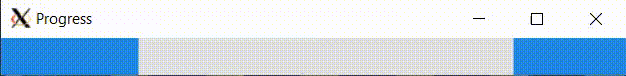
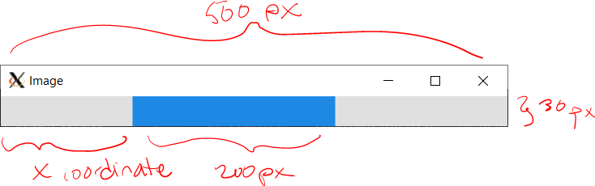
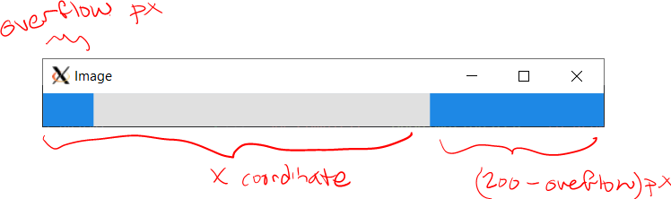

# Indeterminate Progress Bar

You will create an animated indeterminate progress bar. A indeterminate progress bar is one in which the total amount of progress is not known, so rather than showing a fixed percentage it indicates to a user that a process is in motion but the amount left is uncertain.



*I'm not skilled at making gifs, please pardon the hitch when it loops*

## ``ProgressBar``

You will create a progress bar using the ``graphics::AnimationEventListener`` interface, which allows you to update the drawing every 60 milliseconds.

We've provided just one method for you, ``GetImageForTesting``, which will be used by the unit tests to inspect your progress bar image. Please do not modify this method.

### Constructor

``ProgressBar`` should have a default constructor (with no arguments).

### ``graphics::AnimationEventListener`` interface

In ``cpputils/graphics/image_event.h`` you can find the definition of an abstract class ``graphics::AnimationEventListener``. Here's what that interface looks like:

```cpp
/**
 * Abstract interface for listening to AnimationEvents on images. Add and
 * remove with Image::Add/RemoveAnimationEventListener
 * Use Image::ShowUntilClosed with a ms for custom animation duration, and the
 * AnimationListener::OnAnimationStep() will be called at that duration.
 */
class AnimationEventListener {
 public:
  virtual void OnAnimationStep() = 0;
};
```

You can see that a ``graphics::AnimationEventListener`` has one pure virtual method, ``OnAnimationStep``.

``ProgressBar`` needs to inherit from ``graphics::AnimationEventListener`` and override and implement ``OnAnimationStep``. This is where we'll draw the progress bar, slightly differently each time, creating the animation.

First, add ``graphics::AnimationEventListener`` as a class that ``ProgressBar`` publicly inherits from in ``progress_bar.h``.

Put the method prototype for ``OnAnimationStep`` in ``progress_bar.h``, and the implementation in ``progress_bar.cc``.

*Sometimes it's easiest to put ``std::cout`` statements in to make sure that a program is working as expected. For example, you could put a ``std::cout`` statement in ``OnAnimationStep`` to check that method is getting called. If you are doing this "print line debugging" you should make sure to cout ``std::endl`` or ``std::flush`` to see the text updates in the terminal in real-time.*

Add a print line in ``OnAnimationStep`` which will help us see it's working later.

```cpp
void ProgressBar::OnAnimationStep() {
 // TODO: More code will go here in a moment.
 std::cout << "Animation step!" << std::endl;
}
```

Although the ``ProgressBar`` could now receive animation events, we have to hook it up to the image so that it actually does get those events.

### ``ProgressBar::Initialize``: Set up state

``ProgressBar`` needs a method ``Initialize`` that takes an in an integer, the speed, and does not return anything. ``Initialize`` should:

* save the speed integer into a member variable.
* create the image. It should be 500 pixels wide by 30 pixels high.
* draw the progress bar background. The background color should be a grey specified by ``kProgressBackground`` (provided in progress_bar.h). Use the ``Image::DrawRectangle(int x, int y, int width, int height, graphics::Color color)`` method to draw the background.
* add the ``ProgressBar`` as a listener to the ``image_`` by passing the image a reference to the current object. Don't worry about the ``*this`` syntax, we'll learn what that means in a few weeks. For now, just copy-paste the following into ``Initialize``:

```cpp
image_.AddAnimationEventListener(*this);
```

### ``ProgressBar`` destructor

In the destructor you should remove the ``ProgressBar`` from the image to clean up. Copy-paste the following into the destructor:

```cpp
image_.RemoveAnimationEventListener(*this);
```

### ``ProgressBar::Start``: Launch the program

``ProgressBar`` needs a method ``Start`` that takes no arguments and does not return anything.

This method should *only* show the image using ``Image::ShowUntilClosed()``. You can pass in a name for the window if you want, like,

```cpp
image_.ShowUntilClosed("Best progress bar ever!");
```

The ``Start`` method should have no other content. (Separating ``Initialize`` from ``Start`` ensures unit tests will work, and it's good design too!)

## ``main.cc``

In ``int main()`` you should:
* Create a progress bar (make sure to ``#include`` it)
* Initialize the progress bar with some speed
    * 5 looks pretty good, or you can ask the user to enter a number
    * Really it's up to you
* Start the progress bar

That's it!

#### Check: Can you compile and run, and see animation events logged in the terminal?

You should be able to compile now and see 500x30 image, and every 60ms that a message is printed to the console. If it's not working, stop here and make sure you've done the steps above.

Compile and run with a shortcut to create ``main``:

```
make build
./main
```

## Complete ``OnAnimationStep`` to draw the ``ProgressBar``

This is the fun part: creating the animation! ``OnAnimationStep`` is called every time the animation updates.

In this animation you will show a 200 pixel wide rectangle colored with the color ``kProgressForeground``. When the rectangle is too close to the right side of the image to fit, draw a shorter rectangle only up to the edge of the image and put the remaining part of the rectangle on the left side.

You will need to introduce a member variable to track the x coordinate of the start of the rectangle. Initialize this variable to 0.

Each time the ``OnAnimationStep`` is called you should:

* Redraw the progress bar's grey background using ``kProgressBackground`` (erasing the previous bar).

* Draw a 200 pixel wide rectangle colored with the color ``kProgressForeground`` (provided in progress_bar.h), starting at the x coordinate.


    * But if 200 pixels don't fit in the 500 pixel image, draw a shorter rectangle to the right edge and put the rest of the 200 pixels in a second rectangle at the beginning of the image. (You can also achieve this by drawing a ``kProgressForeground`` background and a ``kProgressBackground`` rectangle with width 300px that *ends* at the x coordinate.)

    

* Increment your x coordinate member variable by adding the speed member variable. Use the modulus operator to ensure that the x coordinate remains less than 500 (the image width). Changing the x coordinate is what will create the animation!

* Finally, call ``image_.Flush()`` to force the display to be updated.

Try running your code and use the visual output to debug.

## Customizing (optional)

In addition to picking the speed in ``main.cc``, you can customize your ProgressBar by changing ``kProgressBackground`` and ``kProgressForeground`` in progress_bar.h. These constants are used by the unit tests. Ensure that they are not the same as each other (this will cause unit test failures).

You can also make a copy of this program and draw your own thing -- this might be good starter code for a pac-man that runs across the screen, for example!

## Run the unit tests

We've provided unit tests, which you can try with ``make test``. Use the output to help you debug any issues in your program.

# Submission checklist
1. Compiled and ran the driver (`main`).
1. Manually checked for compilation and logical errors.
1. Ensured no errors on the unit test (`make test`).
1. Followed advice from the stylechecker (`make stylecheck`).
1. Followed advice from the formatchecker to improve code readability (`make formatcheck`).

# Code evaluation
Open the terminal and navigate to the folder that contains this exercise. Assuming you have pulled the code inside of `/home/student/labex02-tuffy` and you are currently in `/home/student` you can issue the following commands

```
cd labex02-tuffy
```

You also need to navigate into the problem you want to answer. To access the files needed to answer problem 1, for example, you need to issue the following command.

```
cd prob01
```

When you want to answer another problem, you need to go back up to the parent folder and navigate into the next problem. Assuming you are currently in `prob01`, you can issue the following commands to go to the parent folder then go into another problem you want to answer; `prob02` for example.

```
cd ..
cd prob02
```

Use the `clang++` command (or ``make build``) to compile your code and the `./` command to run it. The sample code below shows how you would compile code save in `main.cc` `progress_bar.cc` and into the executable file `main`. Make sure you use the correct filenames required in this problem.  Take note that if you make any changes to your code, you will need to compile it first before you see changes when running it.

```
clang++ -std=c++17 main.cc progress_bar.cc -o main -lm -lX11 -lpthread
./main
```

You can run one, two, or all the commands below to `test` your code, `stylecheck` your code's design, or `formatcheck` your work. Kindly make sure that you have compiled and executed your code before issuing any of the commands below to avoid errors.

```
make test
make stylecheck
make formatcheck
```

A faster way of running all these tests uses the `all` parameter.

```
make all
```

# Submission

We recommend pushing to Github frequently to back up your work.
