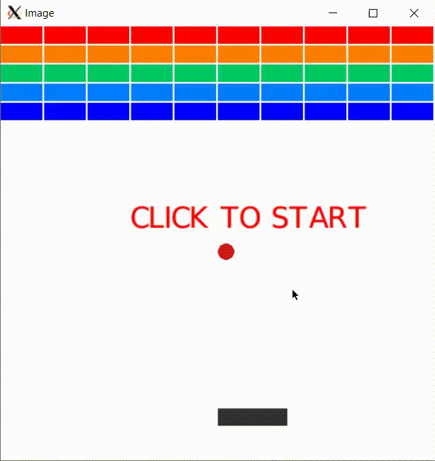

# Breakout Objects

In this lab you will create the objects used in a Breakout game: the bricks, the ball and the paddle. These will be used by the existing gameplay code to allow you to play Breakout!



Knowledge of the game is not important for this lab. If you haven't played, here's a definition of the game Breakout, according to [Wikipedia](https://en.wikipedia.org/wiki/Breakout_(video_game)):

>In Breakout, a layer of bricks lines the top third of the screen and the goal is to destroy them all. A ball moves straight around the screen, bouncing off the top and two sides of the screen. When a brick is hit, the ball bounces back and the brick is destroyed. The player loses [...] when the ball touches the bottom of the screen; to prevent this from happening, the player has a horizontally movable paddle to bounce the ball upward, keeping it in play.

You will create an abstract class, ``SolidObject``, and three derived classes, ``Brick``, ``Paddle`` and ``Ball``, that will be used in gameplay. These classes make use of common methods in ``SolidObject`` dealing with width, height, and (x, y) location on a screen, and for checking whether they collide with another class. In addition, ``SolidObject`` will define a pure virtual function for drawing which can be overridden by each of its derived classes.

Place all classes definitions in ``object.h`` and any implementation in ``object.cc``. You do not need to modify any other files.

## ``SolidObject`` abstract class

### Constructor

Create a constructor that takes an integer width, integer height, and pointer to a ``graphics::Image`` on which to draw. Store these in private member variables.

### Setters

Create setters for integer x and y coordinates which represent the top left corner of the object, ``SetX`` and ``SetY``. Store the x and y in member variables.

### Getters

Create getters for the width, height, x and y position, ``GetWidth``, ``GetHeight``, ``GetX``, and ``GetY``. Note that all getters should be ``const``.

### virtual ``Draw`` function

Define a pure virtual function, ``Draw``, which takes no arguments and does not return anything. Recall that pure virtual functions should be marked ``virtual`` and set equal to zero. ``Draw`` should be ``const``.

### ``protected`` Getter for the image

Create a protected getter for the ``graphics::Image*`` member variable which can be used by the ``Draw`` functions of derived classes.

### Collision detection

Create a ``CollidesWith`` function in ``SolidObject`` that takes a constant pointer to another ``SolidObject``, a ``const SolidObject*``, and returns a boolean. It should return ``true`` if the two objects collide and ``false`` otherwise. ``CollidesWith`` should be ``const``.

When checking collisions you should assume all objects are rectangular. A collision is defined as when the rectangles defined by two objects overlap: that is, when the regions defined by the (x, y) top left corners, width, and height overlap.

If an object has width or height 0, then it cannot collide (return false).

Hint: Rather than checking for overlap, it can be easier to check if two regions do *not* overlap. Check whether the ``SolidObject`` passed in the parameter does *not* overlap with the current object by checking if the right (x + width) edge of one object is less than the other's left edge (x), or the bottom edge (y + height) of one object is less than the other's top edge (y) (and vice-versa, with the objects swapped).

## ``Brick`` class

``Brick`` inherits from ``SolidObject``.

### Constructor

``Brick`` constructor should take an int ``width`` and ``height``, ``graphics::Color``, and ``graphics::Image*``. It should use the parent class constructor with width, height and image, and store the ``graphics::Color`` in a member variable.

### ``Draw`` implementation

``Brick`` should implement ``Draw`` by drawing a rectangle on the ``graphics::Image*`` passed into the ``SolidObject`` constructor. Use the ``Image::DrawRectangle`` function to draw a rectangle from the ``Brick``'s (x, y) coordinate with the ``Brick``'s width and height, colored by the member variable.

Here's the ``Image::DrawRectangle`` function prototype for reference:

```cpp
/**
 * Draws a rectangle with upper left corner at (x, y) and size
 * |width| by |height|, colored by |color|. Returns false if
 * params are out of bounds.
 */
bool DrawRectangle(int x, int y, int width, int height, const Color& color);
```

## ``Paddle`` class

The ``Paddle`` is a ``Brick`` that has a fixed color. So, ``Paddle`` can inherit from ``Brick`` which will handle the drawing code.

### Constructor

``Paddle`` constructor should take a int ``width`` and ``height`` and a ``graphics::Image*``. Use the parent class constructor with the color, ``graphics::Color(50, 50, 50)`` (a grey color).

## ``Ball`` class

``Ball`` inherits from ``SolidObject``.

### Constructor

A ball is round, so it will have the same width and height.

``Ball`` constructor takes an integer the diameter of the ball, and a ``graphics::Image*``. Use the diameter as the width and height when calling the parent constructor.

### ``Draw`` implementation

The (x, y) location of the ``Ball`` object refers to the top left corner. When drawing a circle on a ``graphics::Image`` you reference the center point and the radius.

You will need to convert the ``Ball``'s' width (or height) from diameter to radius by dividing by two (in a circle, ``d = 2 * r``).

You can find the coordinate of the center of the ``Ball`` by adding the radius to its x coordinate and to its y coordinate.

Color the ball using this red color, ``graphics::Color(210, 25, 25)``.

Here's the ``Image::DrawCircle`` function prototype for reference:

```cpp
/**
 * Draws a circle centered at (x, y) with radius |radius|, and color
 * |color|. Returns false if params are out of bounds.
 */
bool DrawCircle(int x, int y, int radius, const Color& color);
```

## Run the program

Now you are ready to play Breakout. Run the program to see if you can find any bugs.

To manually test your code you can compile and run with a shortcut to create ``main``:

```
make build
./main
```

You are welcome to improve gameplay in game.cc / game.h but make sure your program compiles before you submit.

Optional extensions:

* Display score in the game
* Click to restart the game after it ends
* Change the colors of the bricks
* Add more or fewer bricks, change their position
* Add logic to bounce off of the side of a brick (not just off of the top)

## Run the unit tests

We've provided unit tests, which you can try with ``make test``. Use the output to help you debug any issues in your program.

# Submission checklist
1. Completed ``SolidObject``, ``Brick``, ``Paddle`` and ``Ball`` in object.h/object.cc.
1. Compiled and ran the driver (`main`).
1. Manually checked for compilation and logical errors.
1. Ensured no errors on the unit test (`make test`).
1. Followed advice from the stylechecker (`make stylecheck`).
1. Followed advice from the formatchecker to improve code readability (`make formatcheck`).

# Code evaluation
Open the terminal and navigate to the folder that contains this exercise. Assuming you have pulled the code inside of `/home/student/labex02-tuffy` and you are currently in `/home/student` you can issue the following commands

```
cd labex02-tuffy
```

You also need to navigate into the problem you want to answer. To access the files needed to answer problem 1, for example, you need to issue the following command.

```
cd prob01
```

When you want to answer another problem, you need to go back up to the parent folder and navigate into the next problem. Assuming you are currently in `prob01`, you can issue the following commands to go to the parent folder then go into another problem you want to answer; `prob02` for example.

```
cd ..
cd prob02
```

Use the `clang++` command (or ``make build``) to compile your code and the `./` command to run it. The sample code below shows how you would compile code save in `main.cc` `game.cc` and `objects.cc` and into the executable file `main`. Make sure you use the correct filenames required in this problem.  Take note that if you make any changes to your code, you will need to compile it first before you see changes when running it.

```
clang++ -std=c++17 main.cc game.cc objects.cc -o main
./main
```

You can run one, two, or all the commands below to `test` your code, `stylecheck` your code's design, or `formatcheck` your work. Kindly make sure that you have compiled and executed your code before issuing any of the commands below to avoid errors.

```
make test
make stylecheck
make formatcheck
```

A faster way of running all these tests uses the `all` parameter.

```
make all
```

# Submission

We recommend pushing to Github frequently to back up your work.
