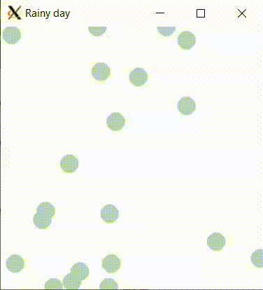

# Animated Rainstorm

You will create an animated rainstorm made of individual falling raindrops.



You will create a ``Raindrop`` class representing an individual drop, and complete a ``Rainstorm`` class that has a collection of ``Raindrop`` pointers. Using dynamic memory allocation you can create and delete ``Raindrops`` as they come on and go off the screen.

This lab focuses on dynamic memory allocation and also reading and modifying existing code.

*Note: You will not get credit unless you use dynamic memory allocation in ``Rainstorm``.*

## ``Raindrop`` class

Create a ``Raindrop`` class which will be used to represent each individual drop on the screen. Place your code in ``raindrop.h`` and ``raindrop.cc``.

``Raindrop`` needs a constructor that takes a ``graphics::Image*``, an integer x and y coordinate for the center of the raindrop, and an integer rate at which the drop falls. Save these four parameters into member variables.

``Raindrop`` needs a const getter, ``GetY()``, which returns the current y coordinate.

Add a member function, ``Fall``, which takes no parameters and increments the y coordinate by adding the fall rate from the constructor.

Finally, create a member function, ``Draw``, which takes no parameters and uses the ``graphics::Image*`` from the constructor to draw a circle centered at the x and y coordinate. Your raindrop circles must be 10 pixels in radius. You can pick the color but it must not be white and it must be a solid color (the unit tests cannot handle fancy raindrops).

## ``Rainstorm`` class

We have provided a basic ``Rainstorm`` class extending the ``graphics::AnimationEventListener`` interface which allows you to update the drawing every 60 milliseconds.

All the required function prototypes are in ``rainstorm.h`` and some implementation is in ``rainstorm.cc``.  You will need to complete code in two member functions, ``OnAnimationStep`` and ``Initialize``, as well as the destructor. Place your code in ``rainstorm.h`` and ``rainstorm.cc``.

### ``Rainstorm::Initialize``: Set up state

``Rainstorm`` has a method ``Initialize`` that takes an integer parameter, the number of raindrops to show, and does not return anything. Update ``Initialize`` to allocate memory for the given number of ``Raindrop`` objects and save the pointers to these objects into a ``std::vector<Raindrop*>`` member variable.
  * Make sure to ``#include`` any new headers
  * Start each raindrop randomly on the image with a random rate. Use provided method ``CalculateRandomRaindropParams`` (defined in ``rainstorm.cc``) which takes pointers to integers for x, y and rate in order to initialize the parameters for the ``Raindrop`` constructor.
  * Call ``Draw`` on each Raindrop to place it on the image.

### ``Rainstorm`` destructor

In addition to what's already done in the starter code, you must delete all the dynamically allocated memory for ``Raindrop`` objects in the vector by calling ``delete`` on each pointer in the vector.

### ``Rainstorm::OnAnimationStep``: Draw the ``Raindrop`` objects

This is the fun part: creating the animation! ``OnAnimationStep`` is called every time the animation updates.

#### ``graphics::AnimationEventListener`` interface

In ``cpputils/graphics/image_event.h`` you can find the definition of an abstract class ``graphics::AnimationEventListener``. Here's what that interface looks like:

```cpp
/**
 * Abstract interface for listening to AnimationEvents on images. Add and
 * remove with Image::Add/RemoveAnimationEventListener
 * Use Image::ShowUntilClosed with a ms for custom animation duration, and the
 * AnimationListener::OnAnimationStep() will be called at that duration.
 */
class AnimationEventListener {
 public:
  virtual void OnAnimationStep() = 0;
};
```

You can see that a ``graphics::AnimationEventListener`` has one pure virtual method, ``OnAnimationStep``.

``Rainstorm`` already inherits from ``graphics::AnimationEventListener`` and overrides and implements ``OnAnimationStep``. This is where we'll draw the rain drops, slightly differently each time, creating the animation.

*Sometimes it's easiest to put ``std::cout`` statements in to make sure that a program is working as expected. For example, you could put a ``std::cout`` statement in ``OnAnimationStep`` to check that method is getting called. If you are doing this "print line debugging" you should make sure to cout ``std::endl`` or ``std::flush`` to see the text updates in the terminal in real-time.*

#### ``Rainstorm::OnAnimationStep``

Each time the ``OnAnimationStep`` is called you should:

* Redraw the image's white background using ``Image::DrawRectangle`` to erase all the previous raindrops from view.

* Draw the raindrops:
    * For each ``Raindrop*`` in the vector, ask it to ``Fall()``, then check its y coordinate is still within the image bounds. If it is within bounds, ``Draw()`` it, otherwise delete it and dynamically allocate memory for a new ``Raindrop``, then replace the pointer to the old ``Raindrop`` in the vector with the pointer to the new one.
    * Each time you create a new ``Raindrop`` you should start it at the top of the image (set y to 0), but initialize the x and rate using ``CalculateRandomRaindropParams`` as described above.
    * Each time you create a new ``Raindrop`` you should draw it immediately.

* Finally, call ``image_.Flush()`` to force the display to be updated.

## ``main.cc``

In ``int main()`` you should:
* Create a rainstorm (make sure to ``#include`` the appropriate headers)
* Initialize the rainstorm with as many raindrops as you like (but more than 0), and
* Start the rainstorm

That's it!

## Test your program

Compile and run with a shortcut to create ``main``:

```
make build
./main
```

Try running your code and use the visual output to debug. Then clean up any extra ``cout`` statements.

## Run the unit tests

We've provided unit tests, which you can try with ``make test``. Use the output to help you debug any issues in your program.

# Submission checklist
1. Created ``Raindrop`` class and completed ``Rainstorm`` class.
1. Compiled and ran the driver (`main`).
1. Manually checked for compilation and logical errors.
1. Ensured no errors on the unit test (`make test`).
1. Followed advice from the stylechecker (`make stylecheck`).
1. Followed advice from the formatchecker to improve code readability (`make formatcheck`).

# Code evaluation
Open the terminal and navigate to the folder that contains this exercise. Assuming you have pulled the code inside of `/home/student/labex02-tuffy` and you are currently in `/home/student` you can issue the following commands

```
cd labex02-tuffy
```

You also need to navigate into the problem you want to answer. To access the files needed to answer problem 1, for example, you need to issue the following command.

```
cd prob01
```

When you want to answer another problem, you need to go back up to the parent folder and navigate into the next problem. Assuming you are currently in `prob01`, you can issue the following commands to go to the parent folder then go into another problem you want to answer; `prob02` for example.

```
cd ..
cd prob02
```

Use the `clang++` command (or ``make build``) to compile your code and the `./` command to run it. The sample code below shows how you would compile code save in `main.cc` `raindrop.cc` `rainstorm.cc` and into the executable file `main`. Make sure you use the correct filenames required in this problem.  Take note that if you make any changes to your code, you will need to compile it first before you see changes when running it.

```
clang++ -std=c++17 main.cc raindrop.cc rainstorm.cc -o main -lm -lX11 -lpthread
./main
```

You can run one, two, or all the commands below to `test` your code, `stylecheck` your code's design, or `formatcheck` your work. Kindly make sure that you have compiled and executed your code before issuing any of the commands below to avoid errors.

```
make test
make stylecheck
make formatcheck
```

A faster way of running all these tests uses the `all` parameter.

```
make all
```

# Submission

We recommend pushing to Github frequently to back up your work.
