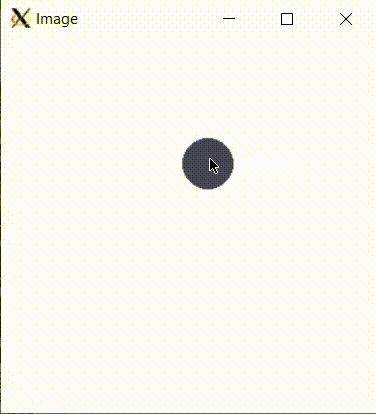

# Bouncing Bubbles

In this lab you will work with existing code to create an animation of bubbles bouncing within an image. It is common to need to work on existing code rather than starting from scratch, so this lab will practice the skill of understanding and working with existing code as well as practice with ``std::unique_ptr``, classes, and polymorphism.



The goal of this program is to create an interactive bubble jar where:
* Pressing the mouse creates a large bouncing bubble at that point,
* Releasing the mouse creates a small bouncing bubble at that point,
* All bubbles pop and disappear once they reach a certain age.

You are provided an ``AbstractBubble`` class in ``abstract_bubble.h`` which handles code for moving, drawing, and bouncing. You are also provided a ``BubbleJar`` class in ``bubble_jar.h`` and ``bubble_jar.cc`` which creates and displays an image, and listens for mouse events and animation events on that image.

You must create two classes that inherit from ``AbstractBubble``, a ``BigBubble`` and a ``SmallBubble``, add a parameter to the ``BubbleJar::Initialize`` to set the maximum age of a bubble, then complete the implementation of ``OnMouseEvent`` and ``OnAnimationStep`` in ``BubbleJar``.

*This lab is purposefully a bit vague, and you are expected to read the comments in the existing code to complete the lab. This more closely mimics real-life programming where you work on projects with other people. Hopefully it also gives you some motiviation for writing good comments in your code!*

## You are given a running, incomplete program

This program already works, however it doesn't do anything. Try it out: you can compile and run with a shortcut to create ``main``:

```
make build
./main
```

## Create ``BigBubble`` and ``SmallBubble`` classes

Read through the ``abstract_bubble.h`` header file to understand what the bubble classes can do, and what parameters bubble methods will take.

Create two classes, ``BigBubble`` and ``SmallBubble``, in ``bubbles.h`` and ``bubbles.cc``. These should inherit from ``AbstractBubble``, implementing the pure virtual method in ``AbstractBubble``. A ``BigBubble`` should have a size of 20 and a ``SmallBubble`` should have a size of 10.

Ensure you create a constructor for ``BigBubble`` and ``SmallBubble`` that takes the same parameters as the parent class constructor.

*You should not edit ``abstract_bubble.h`` or ``abstract_bubble.cc``. This mimics real-world coding on large projects where you frequently need to implement an existing interface.*

## Complete ``BubbleJar`` class

A ``BubbleJar`` is the class that manages user interaction to create bubbles, manages animation events to move the bubbles, and removes old bubbles from the image.

The existing ``BubbleJar`` class already inherits from the correct interfaces but it does not yet complete ``OnAnimationStep`` and ``OnMouseEvent``. You will need to implement those functions in ``bubble_jar.cc``, as well as add a way for the ``BubbleJar`` user to specify the maximum age.

### Maximum age

In the starter code, the ``BubbleJar`` does not have a way to track the maximum age of a bubble before it is removed. You must update the existing ``Initialize`` function to take a maximum age parameter and save it in a member variable.

Then, update ``main.cc`` to pass a maximum age to ``Initialize`` so that the program still runs. (You can try ``make build`` and ``./main`` to test that nothing has broken, although the image still won't show anything.)

## OnMouseEvent

Each time a user presses the mouse down you should generate a new ``BigBubble`` at that location, and each time the user releases the mouse you should generate a new ``SmallBubble`` at that location.

Since we don't know how many times the user will click we must store these bubbles in a collection class instead of individual member variables. Using a ``std::vector`` makes sense here.

It's not possible to create a ``std::vector<AbstractBubble>`` because you cannot create a vector that contains an abstract type (the compiler doesn't know how much space each abstract object takes and throws an error). But while we cannot keep ``AbstractBubble`` objects in the vector directly, it is possible to store pointers to ``AbstractBubble`` instead. Create member variable which is a ``std::vector`` that contains ``std::unique_ptr`` to ``AbstractBubble``.

On each mouse press or release, create a ``std::unique_ptr`` to either a ``BigBubble`` or a ``SmallBubble``, and move that unique pointer into the ``std::vector``. Make sure to ``Draw`` the new bubble and call ``Flush`` on the image so that the display is updated.

> #### Reminder: What is a ``graphics::MouseEvent``?
> It represents a mouse interaction on an image. A ``graphics::MouseEvent`` class has getters for the x and y coordinates of the mouse interaction (``int GetX()`` and ``int GetY()``) and a getter for the type of interaction (``graphics::MouseAction GetMouseAction()``).
>
> Here is the definition of the ``graphics::MouseAction`` enum:
>
> ```cpp
> enum class MouseAction {
>   // Left button down.
>   kPressed = 0,
>   // Moved while left button was down.
>   kDragged,
>  // Left button up.
>   kReleased,
>   // Moved but the left button was not down.
>   kMoved,
> };
> ```
>
> For example, when the user presses the mouse button down at the coordinate (10, 10), we would get a ``graphics::MouseEvent event`` with ``event.GetX() == 10``, ``event.GetY() == 10``, and ``event.GetMouseAction() == graphics::MouseAction::kPressed``.
>

#### Check: Build, run, and see bubbles appear on mouse press/release

Although the bubbles don't animate yet, you should see them draw to the screen on mouse press and release.

### OnAnimationStep

Each time ``OnAnimationStep`` is called, you should ``Move`` and ``Draw`` each bubble in the vector after removing any bubbles in the vector which are equal the maximum age or older.

How to remove the oldest bubbles? Note that the oldest bubbles are at the front of the vector, since they were added first. To remove the first element of a vector, you can use ``erase``. For example, for a ``std::vector`` named ``my_vector``, you could remove the first element by:

```cpp
my_vector.erase(my_vector.begin());
```

Your ``OnAnimationStep`` method should clear the image before drawing the bubbles by drawing a white rectangle the size of the image.

Call ``Image::Flush`` at the end of the method to make sure that opened window is updated.

Now try compiling and running your program again!

## Run the unit tests

We've provided unit tests which you can try with ``make test``. Use the output to help you debug any issues in your program.

# Submission checklist
1. Wrote ``BigBubble`` and ``SmallBubble`` classes and completed ``BubbleJar`` implementation
1. Compiled and ran the driver (`main`).
1. Manually checked for compilation and logical errors.
1. Ensured no errors on the unit test (`make test`).
1. Followed advice from the stylechecker (`make stylecheck`).
1. Followed advice from the formatchecker to improve code readability (`make formatcheck`).

# Code evaluation
Open the terminal and navigate to the folder that contains this exercise. Assuming you have pulled the code inside of `/home/student/labex02-tuffy` and you are currently in `/home/student` you can issue the following commands

```
cd labex02-tuffy
```

You also need to navigate into the problem you want to answer. To access the files needed to answer problem 1, for example, you need to issue the following command.

```
cd prob01
```

When you want to answer another problem, you need to go back up to the parent folder and navigate into the next problem. Assuming you are currently in `prob01`, you can issue the following commands to go to the parent folder then go into another problem you want to answer; `prob02` for example.

```
cd ..
cd prob02
```

Use the `clang++` command (or ``make build``) to compile your code and the `./` command to run it. The sample code below shows how you would compile code saved in `main.cc` `abstract_bubble.cc` `bubble_jar.cc` `bubbles.cc` and into the executable file `main`. Make sure you use the correct filenames required in this problem.  Take note that if you make any changes to your code, you will need to compile it first before you see changes when running it.

```
clang++ -std=c++17 main.cc abstract_bubble.cc bubble_jar.cc bubbles.cc -o main
./main
```

You can run one, two, or all the commands below to `test` your code, `stylecheck` your code's design, or `formatcheck` your work. Kindly make sure that you have compiled and executed your code before issuing any of the commands below to avoid errors.

```
make test
make stylecheck
make formatcheck
```

A faster way of running all these tests uses the `all` parameter.

```
make all
```

# Submission

We recommend pushing to Github frequently to back up your work.
